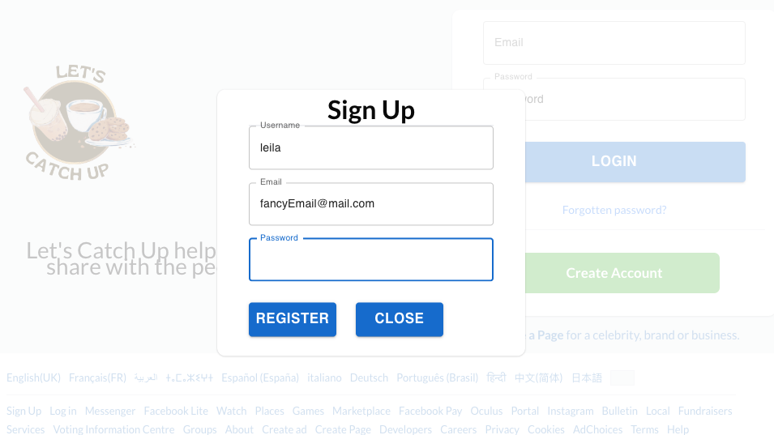
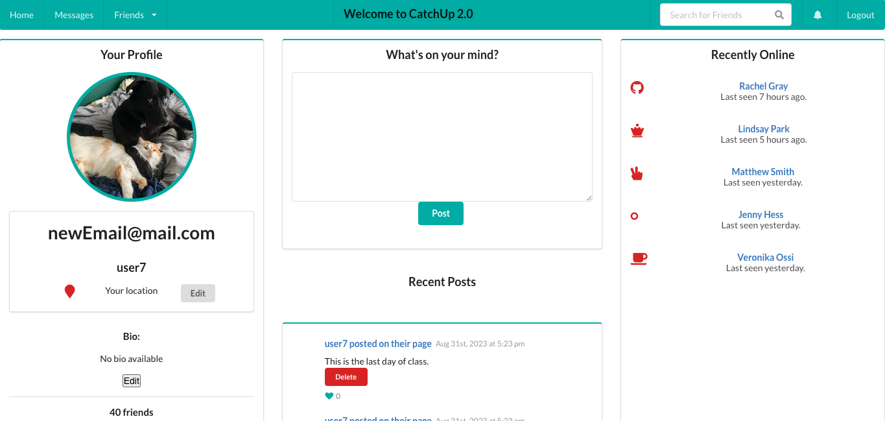

# CatchUp 2.0

## Table of Contents

- [User_Story](#user_story)
- [Description](#description)
- [Installation](#installation)
- [Usage](#usage)
- [Screenshots](#screenshots)
- [Credits](#credits)
- [Collaborators](#collaborators)
- [Tutorials](#tutorials)
- [License](#license)

## User_Story

AS A person that wants to stay in contact with friends and family,
I WANT to post content, and engage with others content,
SO THAT I can maintain relationships online.

## Description

This is a social media application where users can create an account, create a post, delete their own post, view all users’ post, and add comments on other user’s posts. We built this project using the MERN(MongoDb, Express, React, and Node.js) stack, a GraphQl API, user authentication with JWT, and Semantic UI to style our application.

## Installation

There is no installation necessary. Click on the link below to explore our app.

### Deployed Application

[CatchUp 2.0]()

### Check out our Repo.

[CatchUp 2.0 Repo](https://github.com/smokhadar/catch-up2)

## Usage

## Screenshots

## Credits

We thank our instructor Samantha Randolph and the UC Berkley FullStack Bootcamp TA’s for supporting us with building our project. We had help from the users from StackOverflow as well.

## Collaborators

[Deandra](https://github.com/ddiedrick)  
[Nidhi](https://github.com/shahnidhi20)  
[Paola](https://github.com/perfectblue0)  
[Samira](https://github.com/smokhadar)     
[Sarah](https://github.com/minutemin)

## License

Please refer to the link below if you need to read the terms and conditions of the license:
- [MIT License](https://opensource.org/licenses/MIT)

## Tutorials

